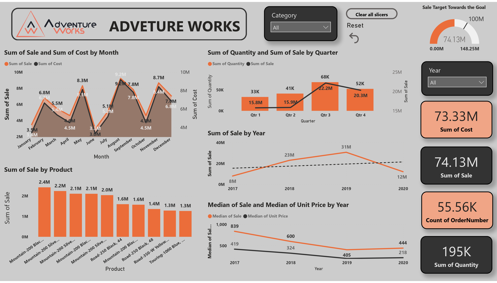
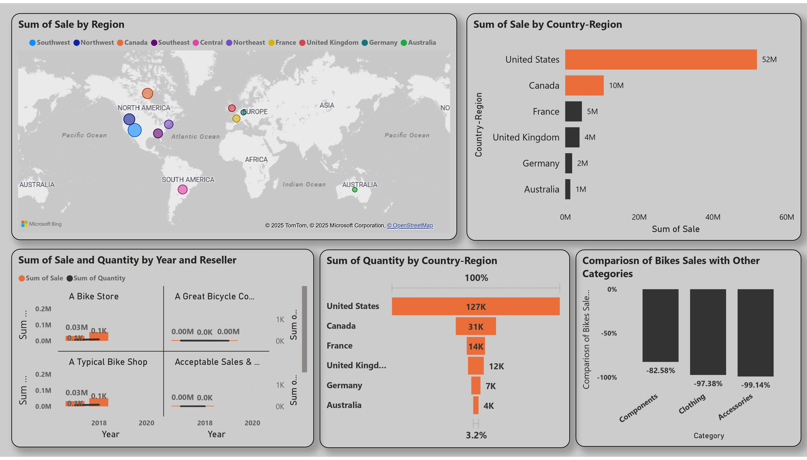
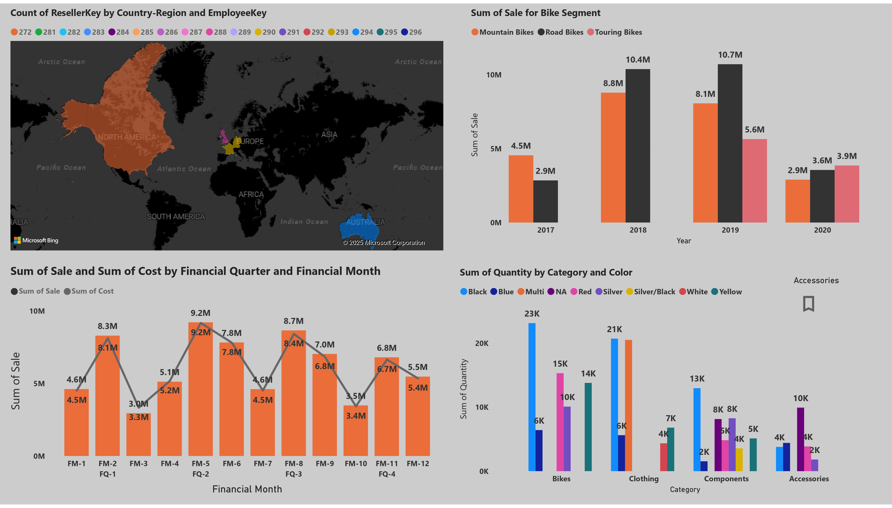
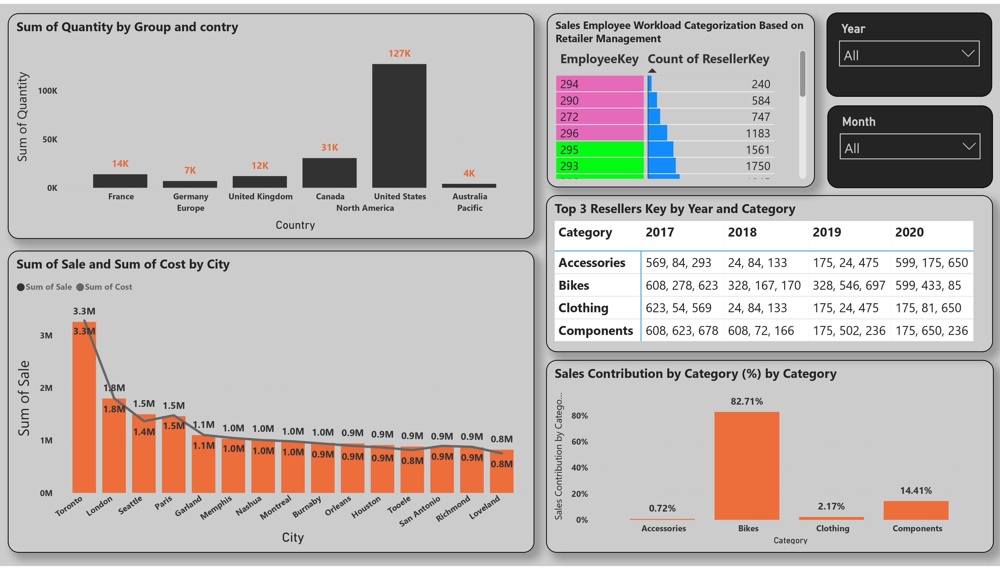
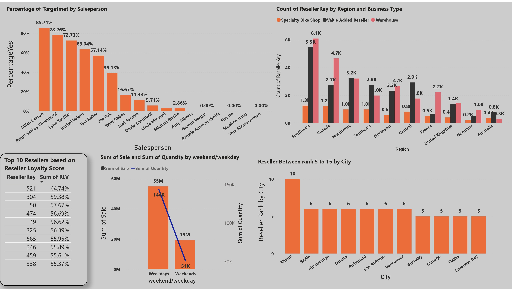
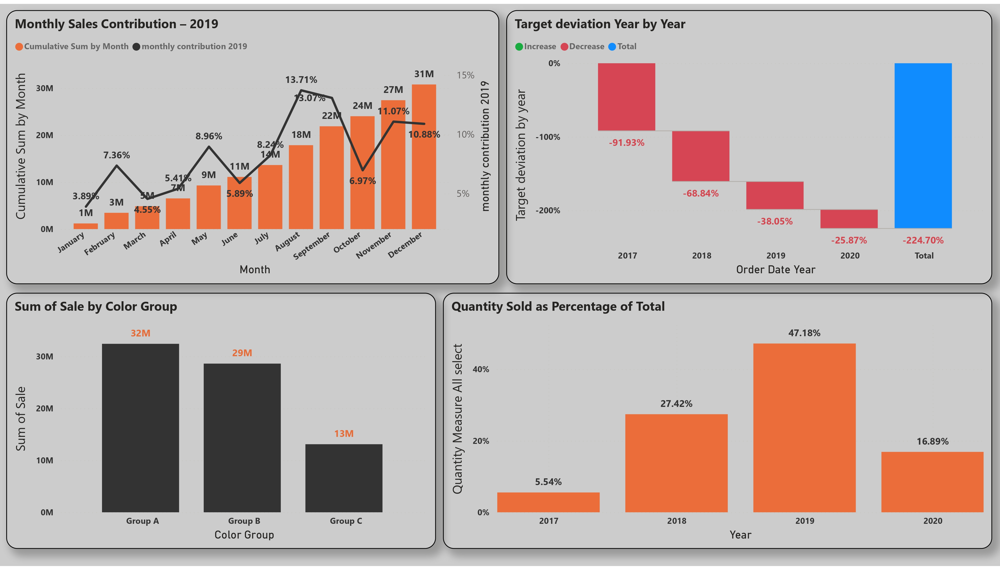

# 📊 Adventure Works Sales Analysis

This Power BI project analyzes the sales data from the AdventureWorks database to uncover trends, evaluate performance metrics, and support data-driven decision-making for stakeholders.

## 🚀 Overview

The **AdventureWorks Sales Analysis Dashboard** offers a comprehensive view of key sales metrics across various dimensions such as products, regions, and time periods. It leverages Microsoft's sample enterprise dataset to simulate real-world business reporting.

## 🧠 Technologies Used

- Power BI Desktop  
- DAX (Data Analysis Expressions)  
- AdventureWorks DW Database (SQL Server sample)  

## 📂 Data Source (sample)

- **AdventureWorksDW2019**  
  Provided by Microsoft as a sample data warehouse for business intelligence and analytics.

🔗 [Download AdventureWorks Sample DB](https://learn.microsoft.com/en-us/sql/samples/adventureworks-install-configure)

## 📊 Dashboard Preview
 

- 📈 **Sales Trend Analysis**  
    - August recorded the highest sum of sales at $9,220,207.46, which was 212.47% higher than June, the month with the lowest sales at $2,950,756.58.
    - Q3 recorded the highest sum of quantity at 68,327, which was 106.50% higher than Q1, the quarter with the lowest quantity sold at 33,088.
    - The year 2019 recorded the highest total sales at $31 million. From January to May 2020, sales reached $12 million. If data for the entire year 2020 were available, it is likely that sales would have exceeded the 2019 total.

    - This variation is due to the available data range, which spans from June 2017 to May 2020.

- 🧾 **Product Performance**  
  - The product `Mountain-200 Black, 38` achieved the highest sales, totaling $2.42 million, followed by `Mountain-200 Silver, 38` and `Mountain-200 Silver, 42`.

> - The Company's sales target is 100 million by the end of 2021. As of May 2020, total sales have reached 74.13 million, indicating string progress towards the goal.
---

- 🌍 **Geographic Insights**  
  The Southwest region recorded the highest total sales at $18,001,116.10, which was 1,194.09% higher than Australia, the region with the lowest sales at $1,391,024.85.

- 📈 **Sales Trend Analysis**  
    - In 2019, Action Bicycle Specialist had the highest sales and quantity sold, followed by continued strong performance in 2020. In year 2017 and 2018, the majority of the sales came from the Bike Store reseller type, highlighting it as the most profitable channel for the brand.
    - Canada accounted for only 24% and France for 10.9% of the quantity sold compared to the United States, highlighting a significant sales concentration in the U.S. market.
    - The United States recorded the highest sales among all country/regions, totaling $52 million, demonstrating its dominant contribution to overall revenue.
    - Bike segment recorded the highest Sales compare to other segments.
---

    - Financial Month 5 (August) contributed 12.44% to the total sum of sales, making it one of the key months in overall revenue performance.
    - Bikes in Color black made up 11.87% of Sum of Quantity.
    - Bike Category made up highest Sales in 2019.
--- 

    - Highest Sales in Toronto, followed by London, Seattle, Paris.
    - Also, Matrix of top 3 resellers by category and year.
    - The bike category gives highest Sales Contribution at 82.71% of the total.
---

    - Jillion Carsen achieved the highest percentage of target met, demonstrating outstanding sales performance compared to other representatives.
    - The Warehouse business type had the highest total count of ResellerKey at 25,391, followed by Value Added Reseller with 22,802 and Specialty Bike Shop with 7,362.
    - Within the Warehouse segment, the Southwest region contributed 10.98% of the total ResellerKey count.
    - On average, Warehouse also led with 2,539.1 ResellerKeys, ahead of Value Added Reseller (2,280.2) and Specialty Bike Shop (736.2).
    - Weekdays generated higher sales compared to weekends, indicating stronger customer engagement during the workweek.
---

    - Quantity Percentage trended up, resulting in a 204.07% increase between 2017 and 2020.
    - By 2020, the target deviation decreased to 25.87, accompanied by total sales reaching $74.12 million, reflecting improved alignment with sales goals.
    - Group A Colors have highest sales compare to other groups.
        - Group A : Blue, Black, NA
        - Group B : Multi, Red, Silver 
        - Group C: Silver/Black, White, Yellow  
---

## 📝 How to Use

1. Download and install **Power BI Desktop**.
2. Clone this repository or download the `.pbix` file.
3. Load the AdventureWorks dataset if required.
4. Open the `.pbix` file and explore the dashboards.

## 📬 Contact

For questions or feedback, reach out at [prayeshgodhani04@gmail.com](mailto:prayeshgodhani04@gmail.com)

---

© 2025 Adventure Works Sales Analysis – Built with Power BI
